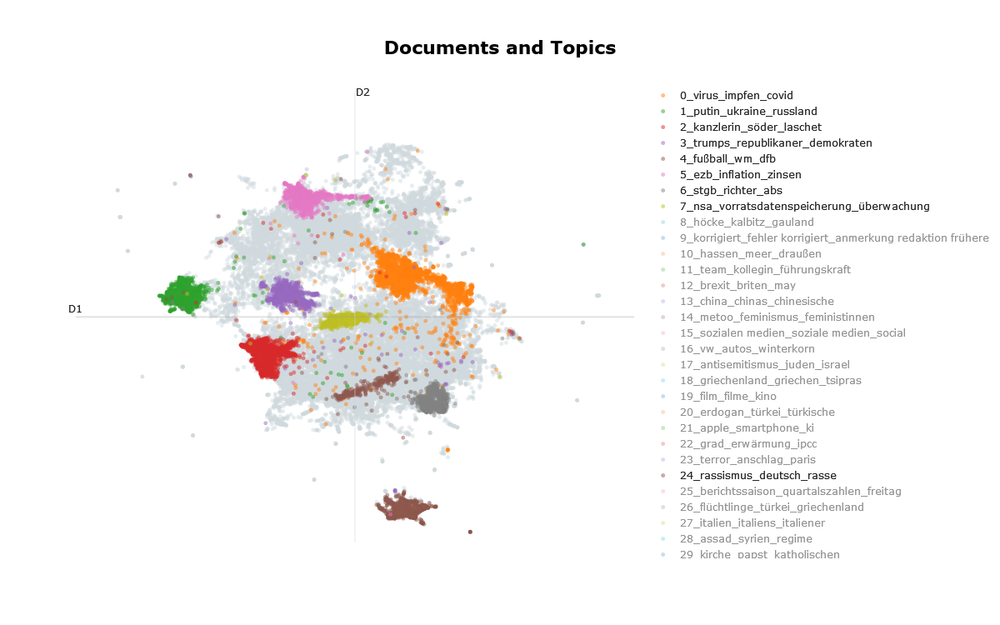
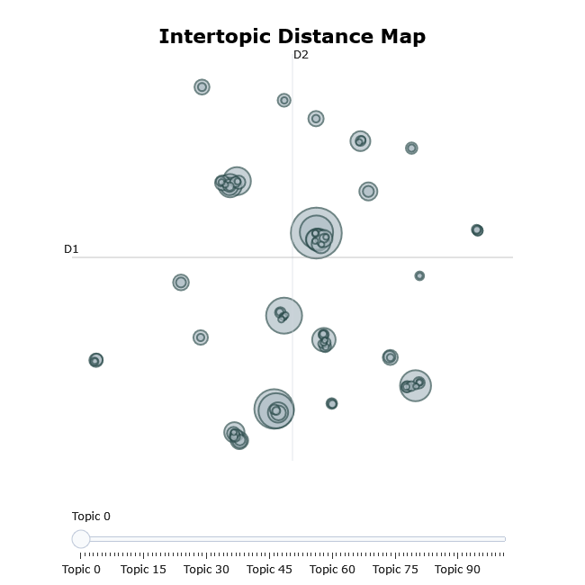
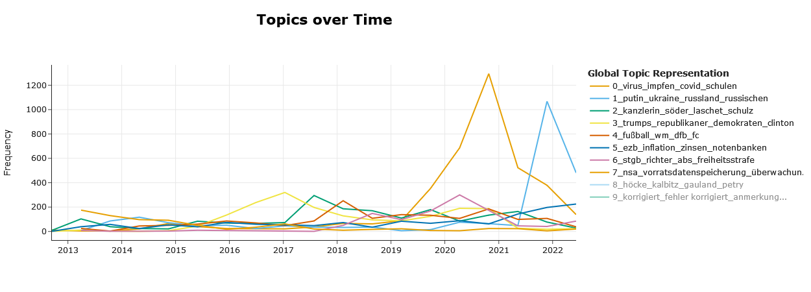
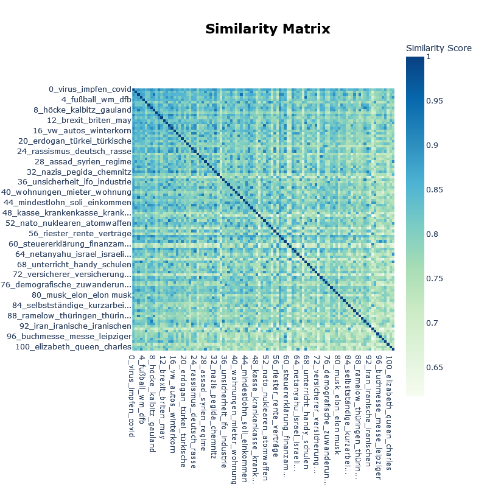

# bertopicr

Topic modeling in R via `reticulate` + the Python `BERTopic` ecosystem (version 0.17.x). Provides helpers for topic inspection and visualization; see the [Quarto notebook](inst/extdata/topics_spiegel.qmd) and the [vignettes](doc/topics_spiegel.Rmd) for an end-to-end training workflow.

<p align="center">
  
</p>

## Installation (R package)

```r
install.packages("devtools")
devtools::install_github("tpetric7/bertopicr")
```

## Python environment setup (pick one)

**A. Virtualenv (base Python)**

```bash
python -m venv r-bertopic

# Windows
r-bertopic\Scripts\activate

# macOS/Linux
source r-bertopic/bin/activate

pip install --upgrade pip
pip install -r inst/requirements.txt
```

**B. Conda**

```bash
conda create -n r-bertopic python=3.10
conda activate r-bertopic
pip install -r inst/requirements.txt
```

(Requirements are bundled at `inst/requirements.txt`. If you have a GPU, install a matching CUDA build of PyTorch in the same env, e.g. `pip install torch torchvision torchaudio --index-url https://download.pytorch.org/whl/cu118`.)

**C. Install via reticulate (inside R)**

```r
library(reticulate)
# Choose ONE of these depending on what you created
target_env <- "r-bertopic"
use_virtualenv(target_env, required = TRUE)      # for virtualenv
# use_condaenv(target_env, required = TRUE)      # for conda

req <- system.file("requirements.txt", package = "bertopicr")
py_install(packages = c("-r", req), envname = target_env, method = "auto", pip = TRUE)
py_config()  # confirm reticulate sees the chosen env
```

## Minimal usage (fit + visualize)

The package focuses on post-fit helpers. Use your preferred BERTopic training code (see the Quarto notebook for a full pipeline), then pass the Python model and outputs into these functions.

```r
library(reticulate)
library(bertopicr)

# Point reticulate to the env you prepared
use_virtualenv("r-bertopic", required = TRUE)
# use_condaenv("r-bertopic", required = TRUE)

# Example: fit a simple model in Python-land
bertopic <- import("bertopic")
np <- import("numpy")
sentencetransformers <- import("sentence_transformers")
embedder <- sentencetransformers$SentenceTransformer("BAAI/bge-m3")
texts <- c("Cats are great pets", "Dogs are loyal companions", "The stock market fluctuates")
embeddings <- embedder$encode(texts, show_progress_bar = FALSE)
model <- bertopic$BERTopic(calculate_probabilities = TRUE)
fit <- model$fit_transform(texts, embeddings)
topics <- fit[[1]]
probs <- fit[[2]]

# Use the R helpers
visualize_topics(model, filename = "intertopic_distance_map", auto_open = FALSE)
visualize_distribution(model, text_id = 1, probabilities = probs, auto_open = FALSE)
```

## Advanced example

See the [vignettes](doc/topics_spiegel.Rmd) or the [Quarto tutorial](inst/extdata/topics_spiegel.qmd) and the[HTML document](inst/extdata/topics__spiegel.html) for a complete workflow (training, representation models [keyBERT, ollama models, ...], dimensionality reduction, clustering, and visualizations).

## Sample visualizations

<p align="center">
  
</p>
<p align="center">
  
</p>
<p align="center">
  
</p>

## Citation

`BERTopic` is described in:

```bibtex
@article{grootendorst2022bertopic,
  title={BERTopic: Neural topic modeling with a class-based TF-IDF procedure},
  author={Grootendorst, Maarten},
  journal={arXiv preprint arXiv:2203.05794},
  year={2022}
}
```

## License

This package is licensed under the MIT License. You are free to use, modify, and distribute this software, provided that proper attribution is given to the original author.
