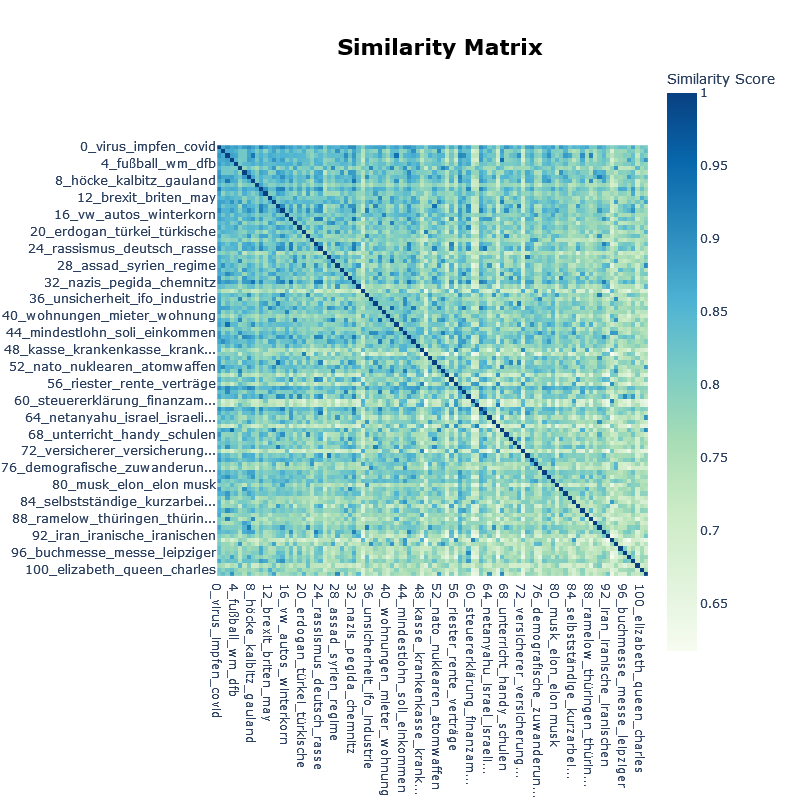

[](https://app.netlify.com/projects/bertopicr/deploys)

# bertopicr

Topic modeling in R via `reticulate` + the Python `BERTopic` ecosystem (version 0.17.x). Provides helpers for training, persistence, topic inspection, and visualization; see the [Quarto notebook](https://github.com/tpetric7/bertopicr/blob/main/inst/extdata/topics_spiegel.qmd) and the [vignettes](https://github.com/tpetric7/bertopicr/blob/main/vignettes/topics_spiegel.Rmd) for an end-to-end workflow.

<p align="center">
  
</p>

## Installation (R package)

```r
install.packages("devtools")
devtools::install_github("tpetric7/bertopicr")
```

## Python environment setup (pick one)

**A. Install inside R via reticulate**

Requires Python installed and discoverable by the R package `reticulate`.
Install Python from python.org and restart R on Windows.

Installation with the `setup_python_environment()` function:

```r
library(bertopicr)
library(reticulate)

setup_python_environment(
  envname = "r-bertopic",
  method = "virtualenv" # or "conda"
)

# Point reticulate at the environment you just created
use_virtualenv("r-bertopic", required = TRUE)
# or use_condaenv("r-bertopic", required = TRUE)
py_config()  # confirm reticulate sees the chosen env
```

Alternatively, setup with the following lines of code:

```r
library(reticulate)
# Choose ONE of these depending on what you created
target_env <- "r-bertopic"
use_virtualenv(target_env, required = TRUE)      # for virtualenv
# use_condaenv(target_env, required = TRUE)      # for conda

req <- system.file("requirements.txt", package = "bertopicr")
# If req is "", reinstall/upgrade the package so the file is available.
py_install(packages = c("-r", req), envname = target_env, method = "auto", pip = TRUE)
py_config()  # confirm reticulate sees the chosen env
```

**B. Virtualenv (base Python)**

```bash
python -m venv r-bertopic

# Windows
r-bertopic\Scripts\activate

# macOS/Linux
source r-bertopic/bin/activate

pip install --upgrade pip
pip install -r inst/requirements.txt
```

**C. Conda**

```bash
conda create -n r-bertopic python=3.10
conda activate r-bertopic
pip install -r inst/requirements.txt
```

(Requirements are bundled at `inst/requirements.txt`. If you have a GPU, install a matching CUDA build of PyTorch in the same env, e.g. `pip install torch torchvision torchaudio --index-url https://download.pytorch.org/whl/cu118`.)

## macOS notes

If reticulate fails to load Python libraries on macOS, install Homebrew `zlib` and
set the fallback library path once per session:

```r
bertopicr::configure_macos_homebrew_zlib()
```

You can install zlib with Homebrew:

```bash
brew install zlib
```

## Minimal usage (fit + visualize)

The package includes helpers for setup, training, and persistence. You can still use your own BERTopic training code, then pass the Python model and outputs into the R helpers.

```r
library(reticulate)
library(bertopicr)

# Point reticulate to the env you prepared
use_virtualenv("r-bertopic", required = TRUE)
# use_condaenv("r-bertopic", required = TRUE)

# Example: train in R
texts <- c("Cats are great pets", "Dogs are loyal companions", "The stock market fluctuates")
topic_model <- train_bertopic_model(texts, embedding_model = "Qwen/Qwen3-Embedding-0.6B")
save_bertopic_model(topic_model, "topic_model")

loaded <- load_bertopic_model("topic_model")
model <- loaded$model
probs <- loaded$extras$probabilities

# Use the R helpers
visualize_topics(model, filename = "intertopic_distance_map", auto_open = FALSE)
visualize_distribution(model, text_id = 1, probabilities = probs, auto_open = FALSE)
```

## Advanced example

See the [vignettes](https://github.com/tpetric7/bertopicr/tree/main/vignettes) (including `train_and_save_model.Rmd` and `load_and_reuse_model.Rmd`) or the [Quarto tutorial](https://github.com/tpetric7/bertopicr/blob/main/inst/extdata/topics_spiegel.qmd) for a complete workflow (training, representation models [keyBERT, ollama models, ...], dimensionality reduction, clustering, and visualizations).

## Scripts

The demo script is available at `inst/scripts/train_model_function_demo.R` and shows end-to-end training, saving, loading, and reuse.

## Sample visualizations

<p align="center">
  
</p>
<p align="center">
  
</p>
<p align="center">
  
</p>

## Citation

`BERTopic` is described in:

```bibtex
@article{grootendorst2022bertopic,
  title={BERTopic: Neural topic modeling with a class-based TF-IDF procedure},
  author={Grootendorst, Maarten},
  journal={arXiv preprint arXiv:2203.05794},
  year={2022}
}
```

## License

This package is licensed under the MIT License. You are free to use, modify, and distribute this software, provided that proper attribution is given to the original author.
