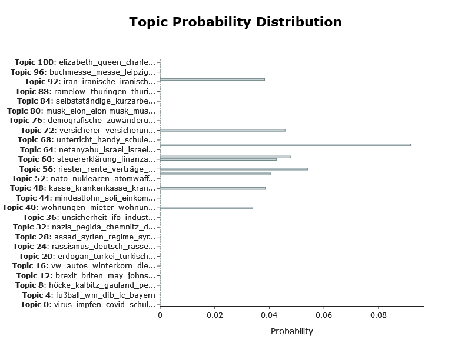
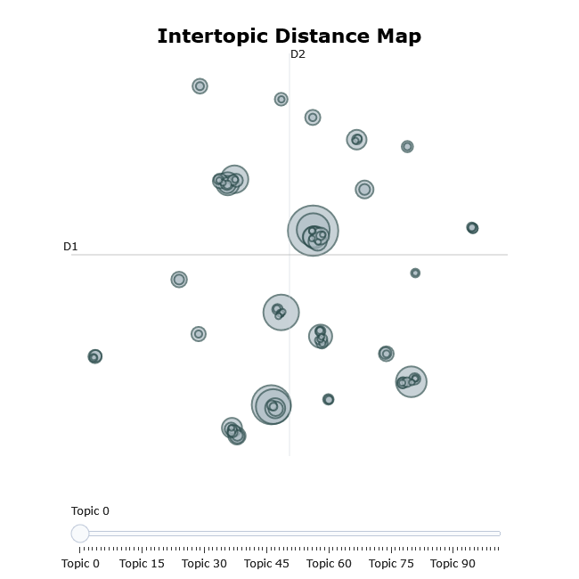
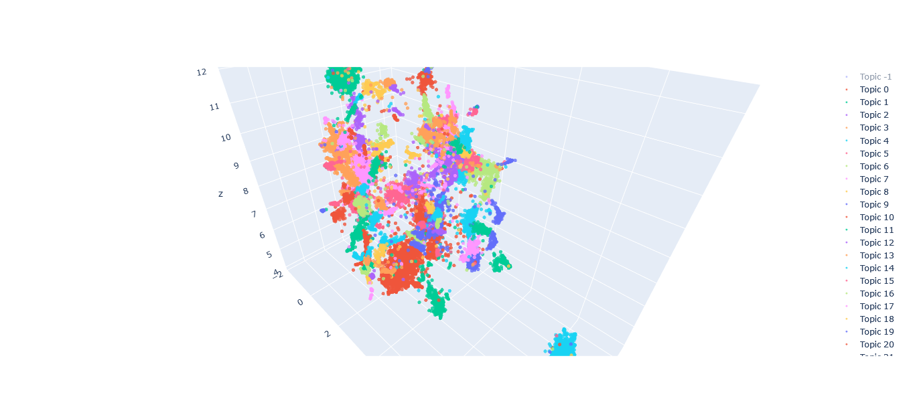
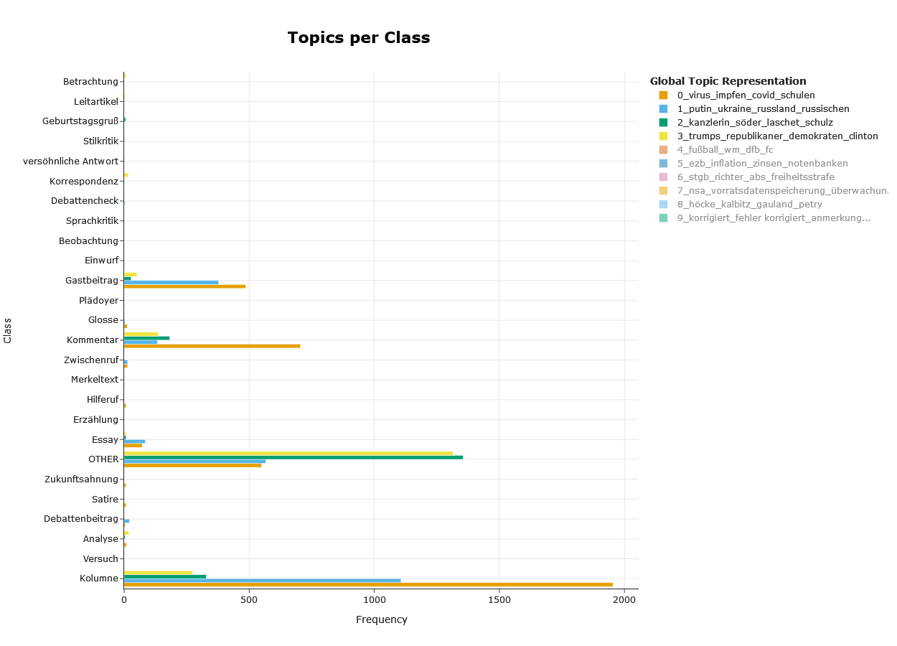

# Topic Modeling with BERTopic in R using reticulate and local LLMs

The package `bertopicr` is based on the Python package `BERTopic` by
Maarten Grootendorst (<https://github.com/MaartenGr/BERTopic>), which is
described in his paper:

> **BERTopic: Neural topic modeling with a class-based TF-IDF
> procedure**  
> Maarten Grootendorst, 2022.  
> Available at: [arXiv:2203.05794](https://arxiv.org/abs/2203.05794)

The package `bertopicr` introduces functions to train and display topic
model results of `BERTopic` models in `R`. The `R` package was created
with the programming support of `OpenAI`’s large language models.

**Note:** The code below requires a specific Python environment. If you
want to preview the outputs without running the full workflow, see the
pre-computed static snapshots in the sections below. For a shorter
workflow and model persistence helpers, see the vignettes
`train_and_save_model.Rmd` and `load_and_reuse_model.Rmd`, and the
updated README.

## Load R packages

Python environment selection and checks are handled in the hidden setup
chunk at the top of the vignette.

*Load* the `R` packages below and *initialize* a `Python` environment
with the `reticulate` package.

By default, `reticulate` uses an isolated `Python` *virtual environment*
named `r-reticulate` (cf. <https://rstudio.github.io/reticulate/>).

The
[`use_python()`](https://rstudio.github.io/reticulate/reference/use_python.html)
and the
[`use_virtualenv()`](https://rstudio.github.io/reticulate/reference/use_python.html)
functions enable you to specify an alternate `Python` environment
(cf. <https://rstudio.github.io/reticulate/>).

``` r
library(dplyr)
library(tidyr)
library(purrr)
library(utils)
library(tibble)
library(readr)
library(tictoc)
library(htmltools)
library(bertopicr)
```

*Note*: Avoid loading conflicting `R` libraries (like `arrow`) alongside
with `Python` modules `BERTopic`, `pyarrow` and `plotly`.

*Note*: If you prefer a streamlined setup,
[`setup_python_environment()`](https://tpetric7.github.io/bertopicr/reference/setup_python_environment.md)
(see README) can install the Python dependencies. The helper functions
[`train_bertopic_model()`](https://tpetric7.github.io/bertopicr/reference/train_bertopic_model.md),
[`save_bertopic_model()`](https://tpetric7.github.io/bertopicr/reference/save_bertopic_model.md),
and
[`load_bertopic_model()`](https://tpetric7.github.io/bertopicr/reference/load_bertopic_model.md)
are showcased in `train_and_save_model.Rmd` and
`load_and_reuse_model.Rmd`.

## Python packages

Use
[`bertopicr::setup_python_environment()`](https://tpetric7.github.io/bertopicr/reference/setup_python_environment.md)
(see README) to install the required Python packages and configure your
environment. The hidden setup chunk at the top of this vignette checks
availability and will skip Python chunks if the environment is not
ready. Install `ollama` or `lm-studio` if you want to serve local
language models.

After setup, we import the Python packages used for topic modeling
below.

``` r
# Import necessary Python modules
py <- import_builtins()
np <- import("numpy")
umap <- import("umap")
UMAP <- umap$UMAP
hdbscan <- import("hdbscan")
HDBSCAN <- hdbscan$HDBSCAN
sklearn <- import("sklearn")
CountVectorizer <- sklearn$feature_extraction$text$CountVectorizer
bertopic <- import("bertopic")
plotly <- import("plotly")
datetime <- import("datetime")
```

## Text preparation

The *German texts* are in the *text_clean* column. They were segmented
into smaller chunks (each about 100 tokens long) to optimize topic
extraction with `bertopicr`. Special characters were removed with a
cleaning function. The text chunks are all in lower case.

``` r
rds_path <- file.path("inst/extdata", "spiegel_sample.rds")
dataset <- read_rds(rds_path)
names(dataset)
dim(dataset)
```

The collected `stopword` list includes German and English tokens and
will be inserted into `Python`’s `CountVectorizer` before `c-TF-IDF`
calculation. But the embedding model will process the text chunks in the
*text_clean* column before `stopword` removal.

``` r
stopwords_path <- file.path("inst/extdata", "all_stopwords.txt")
all_stopwords <- read_lines(stopwords_path)
```

Below are the lists of *texts_cleaned* and *timesteps*, which we need
during model preparation, topic extraction and visualization.

``` r
texts_cleaned = dataset$text_clean
titles = dataset$doc_id
timestamps <- as.list(dataset$date)
# timestamps <- as.integer(dataset$year)

texts_cleaned[[1]]
```

## Model Preparation

For model preparation, we are going to use `reticulate` to interface
with `Python` modules. The `R` code is essentially a conversion of
`Python` code.

The Topic model preparation will also include *local* language models
(via `ollama` or `lm-studio`) leveraging the `OpenAI` endpoint.

### Embeddings

`SentenceTransformer` creates the necessary *embeddings* (vector
representations of text tokens) for topic modeling with `bertopic`. The
first time `SentenceTransformer` is used with a specific model, the
model has to be downloaded from the `huggingface` website
(<https://huggingface.co/>), where many freely usable language models
are hosted (<https://huggingface.co/models>).

``` r
# Embed the sentences
sentence_transformers <- import("sentence_transformers")
SentenceTransformer <- sentence_transformers$SentenceTransformer
# choose an appropriate embeddings model
embedding_model = SentenceTransformer("Qwen/Qwen3-Embedding-0.6B")
embeddings = embedding_model$encode(texts_cleaned, show_progress_bar=TRUE)
```

### Dimension reduction

In the next two steps, the `umap` module reduces the number of
dimensions of embeddings, and the `hdbscan` module extracts clusters
that can evaluated by the topic pipeline.

``` r
# Initialize UMAP and HDBSCAN models
umap_model <- UMAP(n_neighbors=15L, n_components=5L, min_dist=0.0, metric='cosine', random_state=42L)
```

Other dimension reduction methods (like `PCA` or `tSNE`) can be used
instead.

### Clustering

The `hdbscan` module extracts clusters that can be evaluated by the
topic pipeline. Starting with BERTopic version 0.17.0, I had to decrease
the number of parallel workers to `core_dist_n_jobs` = 1 to avoid out of
memory error messages on my `Windows` PC.

``` r
hdbscan_model <- HDBSCAN(min_cluster_size=50L, min_samples = 20L, metric='euclidean', cluster_selection_method='eom', gen_min_span_tree=TRUE, prediction_data=TRUE, core_dist_n_jobs = 1)
```

Other `clustering` methods (like `kmeans`) can be used instead.

### c-TF-IDF

The `Countvectorizer` calculates the `c-TF-IDF` frequencies and enables
the `representation model` defined below to extract suitable keywords as
descriptors of the extracted topics.

`Stopwords` are removed *after* `embeddings` creation, but *before*
`keyword` extraction. Stopword removal is accomplished with the
`CountVectorizer` method.

``` r
# Initialize CountVectorizer
vectorizer_model <- CountVectorizer(min_df=2L, ngram_range=tuple(1L, 3L), 
                                    max_features = 10000L, max_df = 50L,
                                    stop_words = all_stopwords)
sentence_vectors <- vectorizer_model$fit_transform(texts_cleaned)
sentence_vectors_dense <- np$array(sentence_vectors)
sentence_vectors_dense <- py_to_r(sentence_vectors_dense)
```

### Representation models

In the example below, *multiple representation models* are used for
keyword extraction from the identified topics and topic description:
`keyBERT` (part of `BERTopic`), a language model (served locally by
`ollama` via the `OpenAI` endpoint, but it is also possible to use
models from `Groq` or other providers), a Maximal Marginal Relevance
model (`MMR`) and a `spacy` `POS` representation model. By default, only
one representation model is created by `bertopic`.

Before running the following chunk, make sure that all representation
models are downloaded and installed and set
`BERTOPICR_ENABLE_REPR=true`. Otherwise, comment those representation
models out that are missing or won’t be used in the topic training
pipeline. If you want a minimal workflow, use
[`train_bertopic_model()`](https://tpetric7.github.io/bertopicr/reference/train_bertopic_model.md)
instead (see `train_and_save_model.Rmd`).

*Note*: If you use the
[`train_bertopic_model()`](https://tpetric7.github.io/bertopicr/reference/train_bertopic_model.md)
helper (see *Quick Start* section in *Readme.md* and the vignette
*load_and_reuse.Rmd*) instead of the procedure in this notebook, you can
include only one representation model (*default = “none”*).

``` r
# Initialize representation models
keybert_model <- bertopic$representation$KeyBERTInspired()
openai <- import("openai")
OpenAI <- openai$OpenAI
ollama <- import("ollama")
# lmstudio <- import("lmstudio")

# Point to the local server (ollama or lm-studio)
client <- OpenAI(base_url = 'http://localhost:11434/v1', api_key='ollama')
# client <- OpenAI(base_url = 'http://localhost:1234/v1', api_key='lm-studio')

prompt <- "
I have a topic that contains the following documents:
[DOCUMENTS]
The topic is described by the following keywords: [KEYWORDS]

Based on the information above, extract a short but highly descriptive topic label of at most 5 words. Make sure it is in the following format:
topic: <topic label>
"

# download an appropriate LLM to be hosted by ollama or lm-studio
openai_model <- bertopic$representation$OpenAI(client, 
                                               model = "gpt-oss:20b", 
                                               exponential_backoff = TRUE, 
                                               chat = TRUE, 
                                               prompt = prompt)

# downlaod a language model from spacy.io before use here
# Below a German spacy model is used
pos_model <- bertopic$representation$PartOfSpeech("de_core_news_lg")
# diversity set relatively high to reduce repetition of keyword word forms
mmr_model <- bertopic$representation$MaximalMarginalRelevance(diversity = 0.5)

# Combine all representation models
representation_model <- list(
  "KeyBERT" = keybert_model,
  "OpenAI" = openai_model,
  "MMR" = mmr_model,
  "POS" = pos_model
)
```

The *prompt* describes the task the language model has to accomplish,
mentions the documents to work with and the topic labels that it should
derive from the text contents and keywords.

### Zeroshot keywords

`Bertopic` enables us to define a `zeroshot` list of keywords that can
be used to drive the topic model towards desired topic outcomes. In the
topic model below, the zeroshot keyword list is disabled, but can be
activated if needed.

``` r
# We can define a number of topics of interest 
zeroshot_topic_list  <- list("german national identity", "minority issues in germany")
```

### Topic Model

In the next step, we initialize the BERTopic model pipeline and
hyperparameters.

``` r
# Initialize BERTopic model with pipeline models and hyperparameters
BERTopic <- bertopic$BERTopic
topic_model <- BERTopic(
  embedding_model = embedding_model,
  umap_model = umap_model,
  hdbscan_model = hdbscan_model,
  vectorizer_model = vectorizer_model,
  # zeroshot_topic_list = zeroshot_topic_list,
  # zeroshot_min_similarity = 0.85,
  representation_model = representation_model,
  calculate_probabilities = TRUE,
  top_n_words = 200L, # if you need more top words, insert the desired number here!!!
  verbose = TRUE
)
```

### Model Training

After all these preparational steps, the topic model is ready to be
trained with: `topic_model$fit_transform(texts, embeddings)`.

``` r
tictoc::tic()

# Fit the model and transform the texts
fit_transform <- topic_model$fit_transform(texts_cleaned, embeddings)
topics <- fit_transform[[1]]

# Now transform the texts to get the updated probabilities
transform_result <- topic_model$transform(texts_cleaned)
probs <- transform_result[[2]]  # Extract the updated probabilities

tictoc::toc()
```

We obtain the *topic labels* with `topics <- fit_transform[[1]]` and the
*topic probabilities* with `probs <- fit_transform[[2]]`.

### Topic Dynamics

Since our dataset contains time-related metadata, we can use the
`timestamps` for `dynamic topic modeling`, i.e., for discovering topic
development or topic sequences through time. If your data doesn’t
contain any time-related column, skip or disable the timestamps and
topics_over_time calculations.

``` r
# Converting R Date to Python datetime
datetime <- import("datetime")

timestamps <- as.list(dataset$date)
# timestamps <- as.integer(dataset$year)

# Convert each R date object to an ISO 8601 string
timestamps <- lapply(timestamps, function(x) {
  format(x, "%Y-%m-%dT%H:%M:%S")  # ISO 8601 format
})

# Dynamic topic model
topics_over_time  <- topic_model$topics_over_time(texts_cleaned, timestamps, nr_bins=20L, global_tuning=TRUE, evolution_tuning=TRUE)
```

### Store Results

The *topic labels* and *probabilities* are stored in a dataframe named
*results*, together with other variables and metadata.

``` r
# Combine results with additional columns
results <- dataset |> 
  mutate(Topic = topics, 
         Probability = apply(probs, 1, max))  # Assuming the highest probability for each sentence

results <- results |> 
  mutate(row_id = row_number()) |> 
  select(row_id, everything())

head(results,10) |> rmarkdown::paged_table()
```

``` r
results |>
  saveRDS("inst/extdata/spiegel_topic_results_df.rds", version = 2)
results |>
  write_csv("inst/extdata/spiegel_topic_results_df.csv")
```

## Results

The `R` package `bertopicr` will be used in this section to display the
topic modeling results in the form of lists, data frames and
visualizations. The names of the functions are nearly the same as in the
`Python` package `BERTopic`.

### Document information

The
[`get_document_info_df()`](https://tpetric7.github.io/bertopicr/reference/get_document_info_df.md)
creates a dataframe that contains the documents and associated topics,
characteristic keywords, probability scores, representative documents of
a each topic and representation model results (e.g., keywords extracted
by `KeyBERT`, `MMR`, `spacy`, and `LLM` descriptions of the topics).

``` r
library(bertopicr)
document_info_df <- get_document_info_df(model = topic_model, 
                                         texts = texts_cleaned, 
                                         drop_expanded_columns = TRUE)
document_info_df |> head() |> rmarkdown::paged_table()
```

### Representative docs

First, create a data frame similar to *df_docs* below, which contains
the columns Topic, Document and probs. Then use the
[`get_most_representative_docs()`](https://tpetric7.github.io/bertopicr/reference/get_most_representative_docs.md)
function to extract representative documents of a chosen topic.

``` r
# Create a data frame similar to df_docs
df_docs <- tibble(Topic = results$Topic,
                  Document = results$text_clean,
                  probs = results$Probability)
rep_docs <- get_most_representative_docs(df = df_docs, 
                                         topic_nr = 3, 
                                         n_docs = 5)
unique(rep_docs)
```

### Topic information

The function
[`get_topic_info_df()`](https://tpetric7.github.io/bertopicr/reference/get_topic_info_df.md)
creates another useful data frame, which for each of the extracted
topics shows the number of associated documents (or text chunks), topic
id (Name), characeristic keywords according to the chosen representation
models and three (concatenated) representative documents.

``` r
topic_info_df <- get_topic_info_df(model = topic_model, 
                                   drop_expanded_columns = TRUE)
head(topic_info_df) |> rmarkdown::paged_table()
```

### Words in Topics

The
[`get_topics_df()`](https://tpetric7.github.io/bertopicr/reference/get_topics_df.md)
function concentrates on the words associated with a certain topic and
their probability scores. The outliers (Topic = -1) usually are not
included in the analysis. But BERTopic offers a function to reduce the
number of outliers and to update the topic model.

``` r
topics_df <- get_topics_df(model = topic_model)
head(topics_df, 10)
```

### Topic Barchart

The
[`visualize_barchart()`](https://tpetric7.github.io/bertopicr/reference/visualize_barchart.md)
creates an interactive barchart with the top five words of the most
frequently occurring topics.

``` r
visualize_barchart(model = topic_model, 
                   filename = "topics_topwords_interactive_barchart.html", # default
                   open_file = FALSE) # TRUE enables output in browser
```


topics_topwords_interactive_barchart

We might prefer to create a customizable barchart with the `ggplot2`
package by using the dataframe extracted by the
[`get_topics_df()`](https://tpetric7.github.io/bertopicr/reference/get_topics_df.md)
function and run the `plotly` library in `R` with the `ggplotly()`
function for an interactive barchart. Due to possible conflicts between
`R`’s `plotly` library and `Python`’s `plotly` implementation, the
interactive barchart below is disabled.

``` r
library(ggplot2)

barchart <- topics_df |> 
  group_by(Topic) |> 
  filter(Topic >= 0 & Topic <= 8) |> 
  slice_head(n=5) |> 
  mutate(Topic = paste("Topic", as.character(Topic)), 
         Word = reorder(Word, Score)) |> 
  ggplot(aes(Score, Word, fill = Topic)) +
  geom_col() +
  facet_wrap(~ Topic, scales = "free") +
  theme(legend.position = "none")

# # Disabled to avoid poential conflicts
# library(plotly)
# ggplotly(barchart)
```

### Find Topics

The
[`find_topics_df()`](https://tpetric7.github.io/bertopicr/reference/find_topics_df.md)
function is useful for semantic search. It can identify topics that are
associated with a chosen query or multiple queries.

``` r
find_topics_df(model = topic_model, 
               queries = "migration", # user input
               top_n = 10, # default
               return_tibble = TRUE) # default
```

``` r
find_topics_df(model = topic_model, 
                               queries = c("migranten", "asylanten"),
                               top_n = 5)
```

### Get Topics

The
[`get_topic_df()`](https://tpetric7.github.io/bertopicr/reference/get_topic_df.md)
function creates a dataframe that contains the top words extracted from
a chosen topic.

``` r
get_topic_df(model = topic_model, 
                           topic_number = 0, 
                           top_n = 5, # default is 10
                           return_tibble = TRUE) # default
```

### Topic Distribution

The
[`visualize_distribution()`](https://tpetric7.github.io/bertopicr/reference/visualize_distribution.md)
function produces an interactive barchart that displays the associated
topics of a chosen document (or text chunk). The probability scores help
to identify the most likely topic(s) of a document (or text chunk).

``` r
# default filename: topic_dist_interactive.html
visualize_distribution(model = topic_model, 
                       text_id = 1, # user input
                       probabilities = probs) # see model training
```



topic_dist_interactive

### Intertopic Distance Map

The semantic relatedness or distance of topics can be displayed in the
form of a map with the
[`visualize_topics()`](https://tpetric7.github.io/bertopicr/reference/visualize_topics.md)
function.

``` r
visualize_topics(model = topic_model, 
                 filename = "intertopic_distance_map") # default name
```



intertopic_distance_map

### Topic Similarity

We can create a `similarity matrix` by applying cosine similarities
through the generated topic embeddings. The resulting matrix indicates
how similar topics are to each other. To visualize the similarity matrix
we can use the
[`visualize_heatmap()`](https://tpetric7.github.io/bertopicr/reference/visualize_heatmap.md)
function.

``` r
visualize_heatmap(model = topic_model, 
                  filename = "topics_similarity_heatmap", 
                  auto_open = FALSE)
```


topics_similarity_heatmap

### Topic hierarchy

The best way to display the relatedness of documents (or text chunks) is
the
[`visualize_hierarchy()`](https://tpetric7.github.io/bertopicr/reference/visualize_hierarchy.md)
function, which creates an interactive `dendrogram`.

``` r
visualize_hierarchy(model = topic_model, 
                    hierarchical_topics = NULL, # default
                    filename = "topic_hierarchy", # default name, html extension
                    auto_open = FALSE) # TRUE enables output in browser
```

An additional option is the creation of a `hierarchical topics` list
that can be included in the interactive `dendrogram` and enables the
user to identify joint expressions.

``` r
hierarchical_topics = topic_model$hierarchical_topics(texts_cleaned)
visualize_hierarchy(model = topic_model, 
                    hierarchical_topics = hierarchical_topics,
                    filename = "topic_hierarchy", # default name, html extension
                    auto_open = FALSE) # TRUE enables output in browser
```


topic_hierarchy

### Visualize Documents

The
[`visualize_documents()`](https://tpetric7.github.io/bertopicr/reference/visualize_documents.md)
function displays the identified clusters associated with a certain
topic in two dimensions. Usually, it is best to reduce the
dimensionality of the embeddings with `UMAP` (or another dimension
reduction method) to produce intelligible visual results. The
interactive plot allows the user to select one or more clusters with a
double-click of the mouse.

``` r
# Reduce dimensionality of embeddings using UMAP
reduced_embeddings <- umap$UMAP(n_neighbors = 10L, n_components = 2L, min_dist = 0.0, metric = 'cosine')$fit_transform(embeddings)

visualize_documents(model = topic_model, 
                    texts = texts_cleaned, 
                    reduced_embeddings = reduced_embeddings, 
                    filename = "visualize_documents", # default extension html
                    auto_open = FALSE) # TRUE enables output in browser
```


visualize_documents

After updating to `BERTopic=0.17.0`, you might experience that the
[`visualize_documents()`](https://tpetric7.github.io/bertopicr/reference/visualize_documents.md)
function doesn’t render the dots in the scatterplot. A simple
**temporary fix** is to open the `Python` file `_documents.py` of the
[`visualize_documents()`](https://tpetric7.github.io/bertopicr/reference/visualize_documents.md)
function of`BERTopic` (on my `Windows` system it sits in
`anaconda3\envs\bertopic\Lib\site-packages\bertopic\plotting\`) and
change `go.Scattergl` to `go.Scatter` in the `fig.add_trace()` function
(it occurs twice in the `Python` script).

The
[`visualize_documents_2d()`](https://tpetric7.github.io/bertopicr/reference/visualize_documents_2d.md)
function is a variant of the interactive plot above, but with additional
*tooltips*. Set `n_components` = 2L in *reduced_embeddings*!

``` r
# Reduce dimensionality of embeddings using UMAP (n_components = 2L !!!)
reduced_embeddings <- umap$UMAP(n_neighbors = 10L, n_components = 2L, min_dist = 0.0, metric = 'cosine')$fit_transform(embeddings)

visualize_documents_2d(model = topic_model, 
                       texts = texts_cleaned, 
                       reduced_embeddings = reduced_embeddings, 
                       custom_labels = FALSE, # default
                       hide_annotation = TRUE, # default
                       tooltips = c("Topic", "Name", "Probability", "Text"), # default
                       filename = "visualize_documents_2d", # default name
                       auto_open = FALSE) # TRUE enables output in browser
```

To create an interactive 3D plot, the
[`visualize_documents_3d()`](https://tpetric7.github.io/bertopicr/reference/visualize_documents_3d.md)
function can be used. This function is not implemented in the `Python`
package. Set `n_components` = 3L in *reduced_embeddings*!

``` r
# Reduce dimensionality of embeddings using UMAP
reduced_embeddings <- umap$UMAP(n_neighbors = 10L, n_components = 3L, min_dist = 0.0, metric = 'cosine')$fit_transform(embeddings)

visualize_documents_3d(model = topic_model, 
                       texts = texts_cleaned, 
                       reduced_embeddings = reduced_embeddings, 
                       custom_labels = FALSE, # default
                       hide_annotation = TRUE, # default
                       tooltips = c("Topic", "Name", "Probability", "Text"), # default
                       filename = "visualize_documents_3d", # default name
                       auto_open = FALSE) # TRUE enables output in browser
```



visualize_documents_3d

The legend of the *updated*
[`visualize_documents_3d()`](https://tpetric7.github.io/bertopicr/reference/visualize_documents_3d.md)
function shows the Topic keywords (*Name*) instead of the Topic number
and includes a few *tooltips*.

### Topic Development

We can also inspect how a chosen number of topics develop during a
certain period of time. The
[`visualize_topics_over_time()`](https://tpetric7.github.io/bertopicr/reference/visualize_topics_over_time.md)
function assumes that the `timestamps`, the `topic model` and the
`topics over time model` are already defined (e.g., in the model
preparation step after topic model training). The `timestamps` need to
be `integers` or in a a certain `date format` (see model preparation
step above).

``` r
visualize_topics_over_time(model = topic_model, 
                           # see Topic Dynamics section above
                           topics_over_time_model = topics_over_time,
                           top_n_topics = 10, # default is 20
                           filename = "topics_over_time") # default, html extension
```


topics_over_time

### Groups

If our dataset includes categorical variables (groups, classes, etc.),
we can use the
[`visualize_topics_per_class()`](https://tpetric7.github.io/bertopicr/reference/visualize_topics_per_class.md)
function to display an interactive barchart with the groups or classes
associated with a chosen topic. With a double-click of the mouse, the
user can choose a single topic and inspect the frequency of the groups.

``` r
classes = as.list(dataset$genre) # text types
topics_per_class = topic_model$topics_per_class(texts_cleaned, classes=classes)

visualize_topics_per_class(model = topic_model, 
                           topics_per_class = topics_per_class,
                           start = 0, # default
                           end = 10, # default
                           filename = "topics_per_class", # default, html extension 
                           auto_open = FALSE) # TRUE enables output in browser
```



topics_per_class

We could also use the `ggplot2` and `plotly` packages in `R` to produce
a similar looking customized interactive barchart.

## Wordcloud

Wordclouds are not implemented in `BERTopic`, but it is possible to
extract the top n words from a topic. First, spin up a new `BERTopic`
model with `top_n = 200L` (i.e., the 200 most frequent words).

``` r
BERTopic200 <- bertopic$BERTopic
topic_model200 <- BERTopic200(
  embedding_model = embedding_model,
  umap_model = umap_model,
  hdbscan_model = hdbscan_model,
  vectorizer_model = vectorizer_model,
  # zeroshot_topic_list = zeroshot_topic_list,
  # zeroshot_min_similarity = 0.85,
  representation_model = representation_model,
  calculate_probabilities = TRUE,
  top_n_words = 200L, # !!!
  verbose = TRUE
)

tictoc::tic()

# Fit the model and transform the texts
py_fit <- topic_model200$fit(texts_cleaned, embeddings)

# ask Python for the top-200 of the desired topic:
py_topic200 <- py_fit$get_topic(1L, 200L)    # list of (word, score)

names(py_topic200)

rep_list <- py_topic200[["Main"]]

tictoc::toc()
```

Then create a dataframe to plot a wordcloud.

``` r
df_wc <- data.frame(
  name = sapply(rep_list, `[[`, 1),
  freq = as.numeric(sapply(rep_list, `[[`, 2)),
  stringsAsFactors = FALSE
)

library(wordcloud2)
source("inst/extdata/wordcloud2a.R")

wordcloud2a(
  data            = df_wc,
  size            = 0.5,
  minSize         = 0,
  gridSize        = 1,
  fontFamily      = "Segoe UI",
  fontWeight      = "bold",
  color           = "random-dark",
  backgroundColor = "white",
  shape           = "circle",
  ellipticity     = 0.65
)
```

## Conclusion

`BERTopic` is an awesome topic modeling package in Python. The
`bertopicr` package tries to bring some of the functionalities into an
`R` programming environment with the magnificent `reticulate` package as
interface to the `Python` backend.

`BERTopic` offers a number of additional functions, which might be
included in subsequent versions of `bertopicr`.
